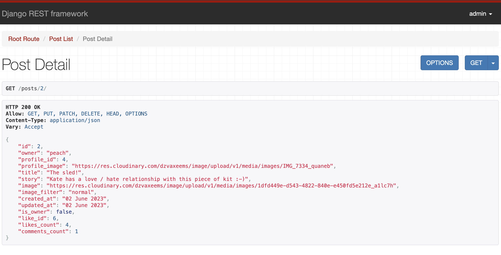

# **BarBelles**

## **API Overview**

The BarBelles API has been developed using the Django Rest Framework in order to serve as the back-end component to Barbelles, an online fitness community for women. The front-end, developed using ReactJS, aims to provide women with a safe and inclusive space to share their own personal fitness journeys as well as the opportunity to learn and interact with other in the community. Users can read posts by others, create, update and delete their own posts as well as follow other users. There is also the facility to add, view, edit or delete comments. Users can learn from video Tutorials added by the site owner, Kate Ross; only users with staff privileges can create, edit or delete tutorials but users can 'favourite' them and add comments. The BarBelles API provides the functionality for all of these interactions, connecting to an external Postgresql database to store images, profile data, videos, comments and followers.

The entire basis of this API is to facilitate and support a smooth, seamless user experience on the front-end.

The deployed API can be viewed [here](https://barbelles-api.herokuapp.com/)

The deployed front-end can be viewed [here](https://barbelles.herokuapp.com/)

The repository for the front-end can be viewed [here](https://github.com/AndypSheridan/barbelles)

## Table of contents:
1. [**Site Overview**](#site-overview)
1. [**Planning stage**](#planning-stage)
    * [**Strategy**](#strategy)
      * [***Site Aims***](#site-aims)
      * [***Target Audiences***](#target-audiences)
      * [***User Stories***](#user-stories)
    * [***Wireframes***](#wireframes)
    * [***Database Schema***](#database-schema)
    * [***Colour Scheme***](#color-scheme)
    * [***Typography***](#typography)
1. [**Agile Development**](#agile-development)
1. [**Features**](#features)
    * [***Admin Page***](#admin-page)
    * [***Posts***](#posts)
    * [***Tutorials***](#tutorials)
    * [***Comments and tutorial comments***](#comments-and-tutorial-comments)
    * [***Likes and favourites***](#likes-and-favourites)
    * [***Followers***](#followers)
    * [***Defensive Design***](#defensive-design)
    * [***User Authentication***](#user-authentication)
    * [***404 Page***](#404-page)
1. [**Future-Enhancements**](#future-enhancements)
1. [**Testing Phase**](#testing-phase)
1. [**Deployment**](#deployment)
1. [**Software and Tech**](#software-and-tech)
1. [**Media**](#media)
1. [**Credits**](#credits)
1. [**Honourable mentions**](#honorable-mentions)

## **Planning Stage**

### **API Aims:**

* Provide the back-end component to a front-end site developed with React.js.
* To assist the user in registering, logging in and logging out on the front-end.
* To provide front-end users with CRUD (create, read, update and delete) functionality for posts found on the site.
* To allow users on the front-end to create, edit and delete their own comments and delete their own.
* To facilitate the functionality for front-end users to follow or un-follow other users in the community.
* To give regular users the opportunity to view tutorials added to the site.
* To allow only the site owner to add, edit or remove tutorials from the front-end.
* To allow for greater community interaction by giving users the opportunity to like or un-like posts.
* Provide filtered content for the front-end user based on whether they follow a user or have liked or favourited tutorials.
* Enhance the user experience integrated search function for those trying to find a specific user or post.
* Offer users the opportunity to provide more information about themselves by adding to their user profile. 

### **User Stories:**

User stories for the project as a whole can be found [here](https://github.com/users/AndypSheridan/projects/3/views/1)

### User stories specific to this API are listed below:

Further details concerning the breakdown of these into Epics can be found in the [Agile Methodology](AGILE.md) file.

#### **Site User**

As a **Registered** user I can: 
* *sign in* in order to *view site content and interact with the community*.
* *navigate the site* easily in order to *view its content and interact with others*.
* *view posts by other users* in order to *take inspiration from the community*.
* *create a post* in order to *share my fitness journey with the community*.
* *update or delete a post* in order to *make changes to my own content or keep my contributions relevant*.
* *comment on other users' posts* in order to *share my opinions and interact with the community*.
* *update comments I make on posts or tutorials* in order to *contribute to, and interact with the community*.
* *upload a profile picture or bio* in order to *tell people a little more about myself*.
* *edit or update my profile* in order to *keep my account up to date*.
* *like or unlike a post* in order to *show my appreciation for other users' contributions*.
* *easily logout* in order to *end my session on the site*.
* *view tutorials* in order to *learn from content added by the site owner*.
* *follow or un-follow other users* so their *posts are added to my feed*.

As an **Unregistered** User I can:
* *sign up* in order to *view site content and interact with the community*.

#### **Site Admin**
As a **Site Admin** I can: 
* *add tutorials in the form of youTube videos* in order to *motivate and educate those in the community*.
* *edit or delete tutorials* in order to *correct mistakes or keep content relevant*.
* *view popular profiles within the community* in order to *see who is the most popular*.
* *respond to questions posted in comments* in order to *interact with and educate the community*.

### **Wireframes**

No wireframes were required for the API. Wireframes for the front-end site can be found in the [Readme](https://github.com/AndypSheridan/barbelles/blob/main/README.md) file for that project.

### **Database Schema**

I used [DrawSQL](https://drawsql.app)​ to help visualise my database tables. See the image below:

## Agile Development

I used Github projects to create and track issues and User Stories. The Agile processes and methodologies can be viewed [here](/AGILE.md)

 

 

# **Features**

## **API Navigation**

Navigation of the API is chiefly through typed urls. The available pages are listed below.

### **Admin Page**

The Admin page was setup almost immediately after creating a superuser in the terminal. This was crucial as it provided an initial means of adding test data and users to the project. Due to the fact I had to wipe my database, I was advised to remove the SQLite3 DB and connect solely to my Postgres database. The screenshot below shows the admin page populated with the most current data at the time of writing.

### **Posts**
​
The post list page shows a list of all posts added either in the admin panel or from the front end:

It is also possible to view the detail of each individual post:

Posts can be edited, updated or deleted on the front-end or via the admin panel.

### **Tutorials**

The tutorial list page shows tutorials uploaded by the site owner or users designated as staff on the backend. The field 'is_staff' in the Profile model can be accessed on the front end, so users for whom 'is_staff' is true, are able to access the 'Share tutorial' link in the front-end navbar.

The tutorial detail page shows the details of each individual tutorial uploaded:

Tutorials can be edited, updated or deleted on the front-end or via the admin panel only by specific users.

### **Comments and tutorial comments**

Users can add comments to both posts and tutorials. Comments are added to posts and tutorial comments are added to tutorials. On the front-end, these are added on the post or tutorial detail page. Lists of each can be seen in the screenshots below:

Details of both individual comments and tutorial comments can be viewed. See below:

Users can create, edit or delete their own comments on the front-end.

### **Likes and favourites**

Likes and favourites are similar in terms of functionality; likes can be added to posts so a user can like or unlike a post on the front end. A filter allows for liked posts to be accessed through a link in the NavBar. Tutorials can be 'favourited' or 'unfavourited' and can also be accessed on the front-end through the favourites link in the navbar. On the back-end, lists of both are rendered as below:

Details of each individual like or favourite can be seen in the screenshots below:

### **Followers**

The API provides the functionality for users on the front-end to follow or un-follow each other. Effectively a follow is created for a 'follow' and destroyed for an 'un-follow'. Each follow can be viewed on the back-end as below:

The detail of each follow can be viewed in more detail by adding its id to the URL and is rendered as below:

### **Pagination**

The API uses pagination to prevent too much data being loaded at once. On the back-end, there are links to view the next page whilst on the front-end, the extra data is loaded via the infinite scroll functionality.

## **Defensive Design**
### **Permissions**

Permission checks are run through the use of the IsAuthenticated class which will grant or deny access to different parts of the API. In the case of this API, it essentially means users cannot edit or delete posts, comments, tutorials, likes or followers that are not their own. This adds a fairly robust level of security and will return a '401 Unauthorized' or '403 Forbidden' response.

The impact on the front-end is such that users with malicious intent will not be able to access content which they shouldn't.

### User Authentication

User authentication is present on the front-end and Users are unable to access any site content unless they are logged in.

### **404 Page**

A custom 404 page for the front-end has been implemented within the scope of that project.

## **Future-Enhancements**
​
There are a number of areas with scope for future improvement. This project has been very challenging and ultimately the project deadline was looming. Upon discussion with the site owner, Miss Ross and I concluded the following features could be added:
​
* A facility to send and receive messages to and from other users in the community.
* An option to purchase packages of extra content and individual or group training.
* An events section which people could sign up for.
* A calendar section outlining live tutorials and classes which people could attend virtually.

## **Testing Phase**

The testing process, along with bugs, can be viewed [here](TESTING.md)​

## **Deployment**

The Deployment was a fairly lengthy process so I have detailed it in a separate file. It can be found [here](/DEPLOYMENT.md)

The final deployment of the API can be viewed [here](https://barbelles-api.herokuapp.com/)

## **Software and Tech**

The following software, libraries and tech were used:

### Languages

- Python

### Frameworks, Libraries and Programs

- [Django](https://www.djangoproject.com/) as a Python framework to develop the project.
- [Cloudinary](https://cloudinary.com) to offer the User a front end method of uploading images.
- [Django Rest Framework](https://www.django-rest-framework.org/) 
- [DrawSQL](https://drawsql.app/) to develop the logic for the project.
- [ElephantSQL](https://www.elephantsql.com/) to handle the PostgreSQL database.
- Git (Gitpod and Github) as my version control for the site.
- [Gitpod](https://gitpod.io/) and VS Code to create, load and push my code to Github.
- [Heroku](https://www.heroku.com/) to deploy the project.
- [Pillow](https://pypi.org/project/Pillow/) to add image processing capabilities.
- [Django Rest Auth](https://django-rest-auth.readthedocs.io/en/latest/) to handle user authentication.
- [Cors Headers](https://pypi.org/project/django-cors-headers/) for handling headers required by Cross Origin Resource Sharing.

## **Credits**

* The creation of this API database was assisted by the Code Institute DRF-API walkthrough. Code has been credited.

* The idea to use Cloudinary to handle media files came from the [Code Institute](https://codeinstitute.net/) walkthrough project: 'Moments'.

* The [Django Documentation](https://docs.djangoproject.com/en/4.1/) was immensely helpful in helping me gain a greater understanding of the project.

* The [Django Rest Framework Documentation](https://www.django-rest-framework.org/) also assisted in helping me gain a greater understanding of the project.

* General References:
  * Stack Overflow
  * Code Institute LMS
  * Cloudinary Documentation
  * Geeks for Geeks
  * W3C School
  * Course material on the CodeCademy website which helped reinforce my understanding of Python, Django and DRF.

## Media

* Default profile image from [Code Institute](https://learn.codeinstitute.net/) walkthrough project.

## **Honourable mentions**

* The biggest thank you goes to my mentor, Richard Wells, who gave a significant amount of his time to provide me with help, feedback and ideas on the project; he has been invaluable in so many ways and a genuine source of motivation for me.
* Thanks to the Code Institute team for providing me with some basic knowledge of Python and Django.
* Thanks to the Code Institute who helped me overcome a major bug in the final deployment of the project
* Thanks to the Code Institute community on Slack who helped remind me that everyone has difficult days.
* A huge thank you to my family who support my coding journey on a daily basis.

Links to additional related files: [AGILE.md](/AGILE.md) | [DEPLOYMENT.md](/DEPLOYMENT.md) | [TESTING.md](/TESTING.md)