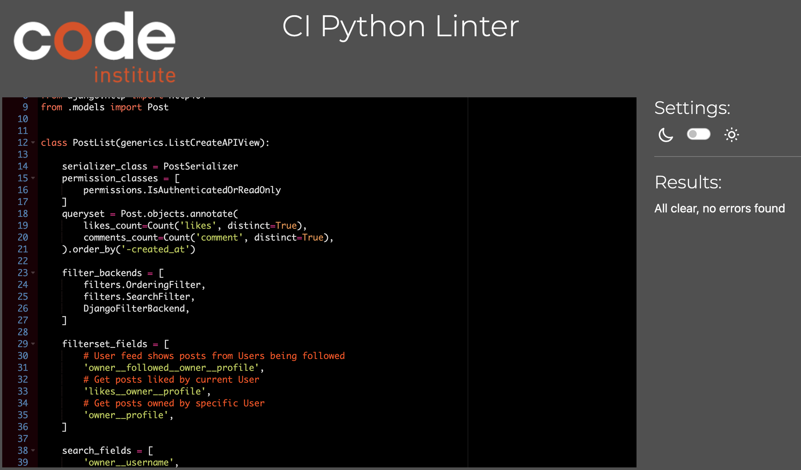
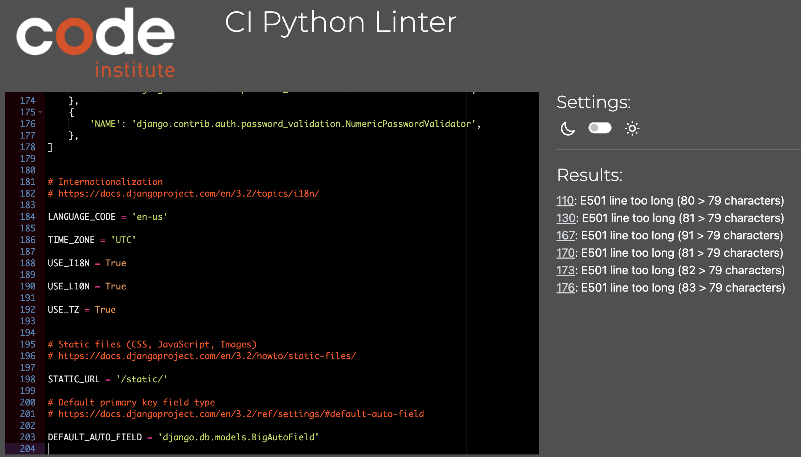

# Testing

* [**Testing Overview**](#testing-overview)
* [**Bugs**](#bugs)
* [**Validation**](#validation)
  * [**Python**](#python)
* [**User Story Testing**](#user-story-testing)
* [**Additional Testing**](#additional-testing)

## **Testing Overview**

At the time of writing, this is the largest project I had undertaken so I felt the testing process needed to be as thorough as possible: 

* Any bugs identified are listed below.

* The Python code was checked using the [Code Institute](https://pep8ci.herokuapp.com/) Python Checker.

* Full details of manual testing can be found on this page.

## **Bugs**
​
The following bugs were identified during user testing:

* Bug 🐞 -  Database became corrupted and would no longer function as intended, failing to load data.
* Cause ⚒️ - Code Institute Tutor Support suggested this happens from time to time and may have arisen from adjusting the Tutorials model.
* Resolution ✅ - Delete all migration files other than the __init__.py file.

 

* Bug 🐞 - When connected to the front end, the follow functionality ceased to work as intended.
* Cause ⚒️ - There was no error in the code. Again, I was advised the database had somehow become corrupted.
* Resolution ✅ - Reset Postgres database, delete all migration files other than __init__.py files, remove SQLite3 database and connect directly to Postgres database in the development environment.

​ 

* Bug 🐞 - The filter function for Posts did not function as intended.
* Cause ⚒️ - There was an indentation error in the views.py file
* Resolution ✅ - Correctly indented the code.

 

* Bug 🐞 - The front end method for Users to add Book or Profile images did not work.
* Cause ⚒️ - Lack of familiarity with, and knowledge of the Cloudinary platform.
* Resolution ✅ - Researched the various methods to upload and save images to Cloudinary and add Cloudinary fields to forms.

 

* Bug 🐞 - The dj-rest-auth logout process did not function.
* Cause ⚒️ - This is a known bug which arises from the fact the 'None' attribute passed to JWT_AUTH_SAMESITE in the settings.py is not passed to the logout view.
* ✅ - Add custom logout view and pass additional attributes.

## **Unfixed Bugs**

* At this stage, there are no known unfixed bugs.

## **Validation**

### ***Python Code***

The code was validated using the [Code Institute](https://pep8ci.herokuapp.com/) Python Checker. All files passed validation and no significant issues were identified in the code. See image below.

This highlights an error in line length which I was unable to rectify without breaking the code. I decided against changing it.

Any further errors displayed also related line length. I was unsure how to remedy this without compromising the code within the file so overlooked these too.

## **Manual Testing**

Many of the User Stories relating to the project as a whole (front-end and back-end) are clearly documented in the [AGILE.md](/AGILE.md) file. The following outlines the testing of User Stories specific to the API.

### User Stories

#### As a Site Admin / User I can:

#### Create

* User Story 📖: Create a user profile.
* Test 🧪: Use the IDE terminal to create a superuser, use the admin panel to create users.
* Result 🏆: Using both methods, instances were created successfully.
* Verdict ✅: Test passed.

 

* User Story 📖: Create a post.
* Test 🧪: The admin panel was used to create test posts, both with and without images. If no image was added, the default image was assigned.
* Result 🏆: Posts were created successfully
* Verdict ✅: Test passed.

 

* User Story 📖: Create a tutorial.
* Test 🧪: The admin panel was used to create test tutorials. In the API testing phase, an entire YouTube link was added but on the front end, only the embed link is necessary.
* Result 🏆: Tutorials were created successfully.
* Verdict ✅: Test passed.

 

* User Story 📖: Create comments for posts or tutorials.
* Test 🧪: Use the admin panel to create comments for both.
* Result 🏆: Comments were created successfully.
* Verdict ✅: Test passed.

 

* User Story 📖: Create likes  and favourites for posts or tutorials.
* Test 🧪: Navigate to the specific URL and add likes and favourites manually.
* Result 🏆: Instances were created successfully.
* Verdict ✅: Test passed.

 

* User Story 📖: Create followers for User profiles.
* Test 🧪: Navigate to the specific URL and add followers manually.
* Result 🏆: Instances were created successfully.
* Verdict ✅: Test passed.

#### Read

* User Story 📖: View a list of posts.
* Test 🧪: Add test posts and navigate to list view URL to check they are displayed.
* Result 🏆: Instances were displayed as intended.
* Verdict ✅: Test passed.

 

* User Story 📖: View a list of tutorials.
* Test 🧪: Add test tutorials and navigate to list view URL to check they are displayed.
* Result 🏆: Instances were created successfully.
* Verdict ✅: Test passed.

 

* User Story 📖: View the detail of a post.
* Test 🧪: Navigate to detail view URL to check they are displayed.
* Result 🏆: Instances were displayed successfully.
* Verdict ✅: Test passed.

 

* User Story 📖: View the detail of a tutorial.
* Test 🧪: Navigate to detail view URL to check they are displayed.
* Result 🏆: Instances were displayed successfully.
* Verdict ✅: Test passed.

 

* User Story 📖: View comments on posts or tutorials.
* Test 🧪: Create test comments and navigate to list and detail view URLs to check they are displayed.
* Result 🏆: Instances were displayed successfully.
* Verdict ✅: Test passed.

#### Update

* User Story 📖: Update a profile.
* Test 🧪: Update a profile in the admin panel and using the API URL.
* Result 🏆: Both methods successfully updated a profile.
* Verdict ✅: Test passed.

 

* User Story 📖: Update a post or tutorial.
* Test 🧪: Use the admin panel or URL to update posts and tutorials.
* Result 🏆: Instances were updated successfully.
* Verdict ✅: Test passed.

 

* User Story 📖: Update comments made on posts and tutorials.
* Test 🧪: Use admin panel and URL to update a comment.
* Result 🏆: Comments were updated successfully.
* Verdict ✅: Test passed.

 

#### Delete

* User Story 📖: Delete a post or tutorial.
* Test 🧪: Use admin panel or URL to delete a post or tutorial.
* Result 🏆: Instances were deleted successfully.
* Verdict ✅: Test passed.

 

* User Story 📖: Delete a comment from a post or tutorial.
* Test 🧪: Use admin panel or URL to delete a comment which has been assigned to a post or tutorial.
* Result 🏆: Instances were deleted successfully.
* Verdict ✅: Test passed.

 

* User Story 📖: Delete a like or favourite.
* Test 🧪: Use admin panel or URL to delete a like or favourite which had been assigned to a tutorial.
* Result 🏆: Instances were deleted successfully.
* Verdict ✅: Test passed.

 

* User Story 📖: Delete a follower.
* Test 🧪: Deleting a follower is essentially 'unfollowing' a user profile. This test using the admin panel and page URL was to ensure the instance was destroyed.
* Result 🏆: Instances were deleted successfully.
* Verdict ✅: Test passed.

## **Additional Testing**

* Aim 🎯: Test URL paths open without error.
* Test 🧪: Type each URL and check the page renders as expected.
* Result 🏆:  Each page displayed as expected.
* Verdict ✅: Test passed.

 

* Aim 🎯: Test Search feature for Posts, Tutorials return results.
* Test 🧪: Use the filter function in the API to check results were returned.
* Result 🏆: Filter and search functioned as intended.
* Verdict ✅: Test passed.​

Back to [README](/README.md)